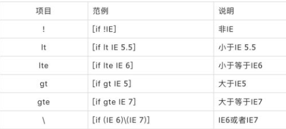
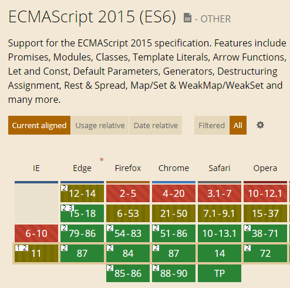
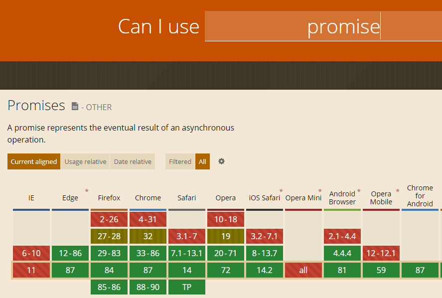
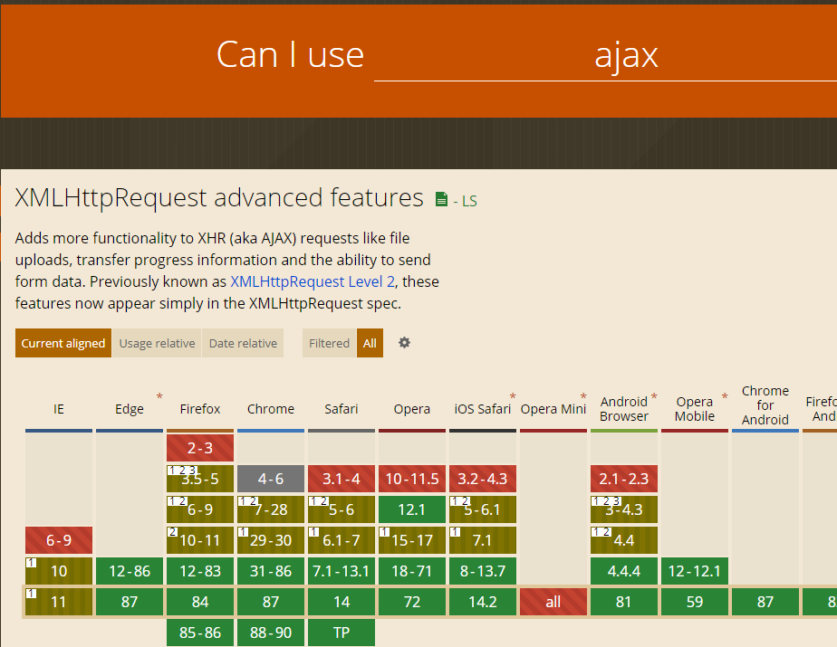
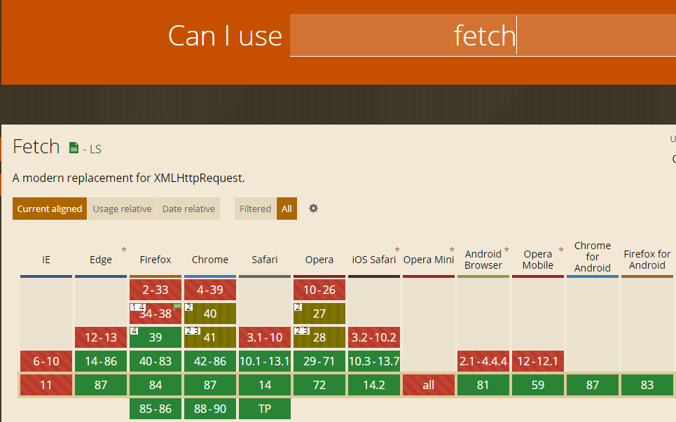

# 兼容问题
[链接：兼容性查看站点](https://caniuse.com/)

> 对 IE 浏览器的兼容问题，可以大致分为

* A 级兼容（Chrome、Firefox、IE9+）：要保证在最新浏览器上完美实现设计稿；
* B 级兼容（IE8）：能用且差别不大；
* C 级兼容（IE7 以下）：能用。

> 处理兼容问题的思路

* 首先以最大程度完善设计稿为基础，再考虑兼容性，不能盲目为了兼容问题而弃用方便简洁的新方法（如 HTML5、CSS3）；当然也不能用过新的技术方法使得兼容性过于低、实用性差。

## 常用的兼容解决方式

> 条件注释



```
    <!--[if IE 6]>
    <p>You are using Internet Explorer 6.</p>
    <![endif]-->

    <!--[if !IE]><!-->
    <script>alert(1);</script>
    <!--<![endif]-->

    <!--[if IE 8]>
    <link href="ie8only.css" rel="stylesheet">
    <![endif]-->
```

**注：IE10 不再支持条件注释**

> js判断浏览器类型 navigator.userAgent对象

```
 var browser = {
    versions: function () {
        var u = navigator.userAgent, app = navigator.appVersion;
        return {         //移动终端浏览器版本信息
            trident: u.indexOf('Trident') > -1, //IE内核
            presto: u.indexOf('Presto') > -1, //opera内核
            webKit: u.indexOf('AppleWebKit') > -1, //苹果、谷歌内核
            gecko: u.indexOf('Gecko') > -1 && u.indexOf('KHTML') == -1, //火狐内核
            mobile: !!u.match(/AppleWebKit.*Mobile.*/), //是否为移动终端
            ios: !!u.match(/\(i[^;]+;( U;)? CPU.+Mac OS X/), //ios终端
            android: u.indexOf('Android') > -1 || u.indexOf('Linux') > -1, //android终端或uc浏览器
            iPhone: u.indexOf('iPhone') > -1, //是否为iPhone或者QQHD浏览器
            iPad: u.indexOf('iPad') > -1, //是否iPad
            webApp: u.indexOf('Safari') == -1 //是否web应该程序，没有头部与底部
        };
    }(),
    language: (navigator.browserLanguage || navigator.language).toLowerCase()
} 
```

## 一 HTML5标签兼容性
#### 解决方法
## 二 CSS3兼容性

> css3 属性兼容列表

  

> css3 选择器兼容列表
 
  

> 默认margin padding 不同 

* h1-h6,ol,ul,p,form 等...标签中有默认的margin padding 值
```
    *{margin:0;padding:0;}
```

> 仅在ie中生效的css
 
 ```
 @media screen and(-ms-high-contrast:active),(-ms-high-contrast:none){
    .search-card-list-body{
        margin-bottom: 20px;
    }
}
 ```

> CSS Hack

```
    .box {
        color: red;
        _color: blue; /* IE6 下它生效 */
        *color: pink; /* IE67 下它生效 */
        color: yellow\9; /* IE/Edge 6-8 下它生效 */
    }
```
[链接：更多cssHack方式 参考 CSS hack合集_w3cschool](https://www.w3cschool.cn/lugfe/lugfe-vxfp25zq.html)


> 各主流浏览器私有属性兼容

* Webkit 类型（如 Safari、Chrome）的私有属性是以-webkit-前缀开始。
* Gecko 类型（如 Firefox）的私有属性是以-moz-前缀开始。
* presto 类型（Opera）的私有属性是以-o-前缀开始
* trident 类型 （IE）的私有属性是以-ms-前缀开始
* Konqueror 类型的浏览器的私有属性是以-khtml-前缀开始

解决方式：postcss和autoprefixer

```
    // 安装
    npm install postcss
    npm install autoprefixer        

    // 使用
    module:{
    rules:[
        {
        test:/\.vue$/,
        loader: 'vue-loader',
        options:{
            vueLoaderConfig,
            postcss:[require('autoprefixer')({ browsers: ['last 10 Chrome versions', 'last 5 Firefox versions', 'Safari >= 6', 'ie> 8'] })]
         }
        },

    // 配置
    "browserList":[
        "> 1%",
        "Last 2 versions",
        "not ie <= 8",
        "iOS >= 8",
        "Firefox >= 20",
        "Android > 4.4"
    ]    

```


## 三 JS 兼容性
#### 1. ES6

> 桌面浏览前对ES6的支持情况

* Chrome：51 版起便可以支持 97% 的 ES6 新特性。
* Firefox：53 版起便可以支持 97% 的 ES6 新特性。
* Safari：10 版起便可以支持 99% 的 ES6 新特性。
* IE：Edge 15可以支持 96% 的 ES6 新特性。Edge 14 可以支持 93% 的 ES6 新特性。（IE7~11 基本不支持 ES6）



> 保证es6的兼容性的方式

* 比较通用的工具方案有 babel，traceur，es6-shim 等

> 解决用例

* 引入browser.min.js ; script标签的type的值设为text/babel。

```
    <!DOCTYPE html>
<html lang="ch">
<head>
    <meta charset="UTF-8">
    <meta name="viewport" content="width=device-width, initial-scale=1.0">
    <meta http-equiv="X-UA-Compatible" content="ie=edge">
    <title>Document</title>
</head>
<body>
    <script type="text/javascript" src="./babel/browser.min.js"></script>
    <script type="text/babel">
        const list = ['one','two','three']; 
        list.forEach( (item,index) => { 
            alert(item + (index+1)); 
        });
    </script>
</body>
</html>
```

* Polyfill（代码填充） 的技术。

```
    <script type="text/javascript" src="./babel/browser-polyfill.min.js"></script>
```

* 使用babel编译

```
    // 安装babel
    npm install --save-dev @babel/core @babel/cli @babel/preset-env @babel-loader

    // .babelrc 文件
    presets: "presets": [ "es2015","stage-0"],

    /** webpack 配置 **/

    // entry 节点
    entry: {
        app: ['babel-polyfill', './src/main.js']
    }

    // 配置loader 
    {
        test: /\.js$/,
        exclude: /node_modules/,
        loader: 'babel-loader'
    }

```

* traceur 使用

```
    <script src="https://google.github.io/traceur-compiler/bin/traceur.js"></script>
    <script src="https://google.github.io/traceur-compiler/bin/BrowserSystem.js"></script>
    <script src="https://google.github.io/traceur-compiler/src/bootstrap.js"></script>
    <script type="module">
        import './Greeter.js';
    </script>

    // 第一个是加载 Traceur 的库文件 ; 第二个和第三个是将这个库文件用于浏览器环境

    // type = module  这是Traceur编译器识别ES6代码的标志  自动将里面的代码编译成es5

    /*更精确的Traceur配置*/
    
    <script>
        // Create the System object
        window.System = new traceur.runtime.BrowserTraceurLoader();
        // Set some experimental options
        var metadata = {
            traceurOptions: {
            experimental: true,
            properTailCalls: true,
            symbols: true,
            arrayComprehension: true,
            asyncFunctions: true,
            asyncGenerators: exponentiation,
            forOn: true,
            generatorComprehension: true
            }
        };
        // Load your module
        System.import('./myModule.js', {metadata: metadata}).catch(function(ex) {
            console.error('Import failed', ex.stack || ex);
        });
    </script>
```

* es6-shim

```
    npm install es6-shim

    --------------------

    require('es6-shim');
```

[链接:es6-shim 文档](https://github.com/paulmillr/es6-shim)


#### 2. PROMISE AJAX FETCH AXIOS

> promise 兼容 




> ajxa 兼容性




** IE下  responseType不支持json    会返回undefined **

* 添加meta  强制edge

```
    <meta http-equiv="X-UA-Compatible" content="IE=edge">
```

* json2.js json3.js 序列化返回


> fetch 兼容



* isomorphic-fetch 解决

```
    import 'isomorphic-fetch'
```

* 使用三方库解决

原生支持率并不高，幸运的是，引入下面这些 polyfill 后可以完美支持 IE8+ ：

>> 由于 IE8 是 ES3，需要引入 ES5 的 polyfill: es5-shim, es5-sham

>> 引入 Promise 的 polyfill: es6-promise

>> 引入 fetch 探测库：fetch-detector

>> 引入 fetch 的 polyfill: fetch-ie8

>> 可选：如果你还使用了 jsonp，引入 fetch-jsonp

>> 可选：开启 Babel 的 runtime 模式，现在就使用 async/await

Fetch polyfill 的基本原理是探测是否存在 window.fetch 方法，如果没有则用 XHR 实现。这也是 github/fetch 的做法，但是有些浏览器（Chrome 45）原生支持 Fetch，但响应中有中文时会乱码，老外又不太关心这种问题，所以我自己才封装了 fetch-detector 和 fetch-ie8 只在浏览器稳定支持 Fetch 情况下才使用原生 Fetch。这些库现在 每天有几千万个请求都在使用，绝对靠谱 ！

终于，引用了这一堆 polyfill 后，可以愉快地使用 Fetch 了。但要小心，下面有坑：

[链接：fetch兼容相关问题](https://github.com/camsong/blog/issues/2)


## 四 BOM DOM兼容性
## 五 HACK兼容写法
## 六 项目中遇到的兼容问题